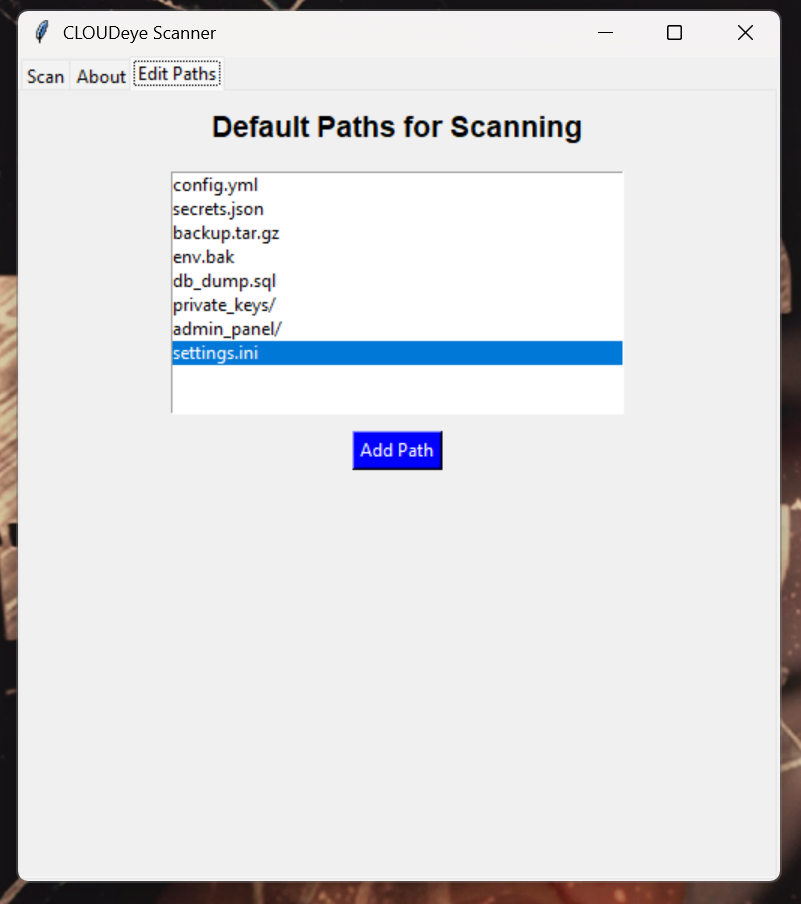

# CLOUDeye Scanner


## Overview
CLOUDeye Scanner is a powerful security tool designed to uncover misconfigurations, sensitive files, and exposed data on web servers. It is tailored for security professionals to identify potential vulnerabilities such as leaked API keys, exposed credentials, and other insecure configurations.

> **⚠️ Disclaimer:** Ensure you have explicit authorization before scanning any servers. Unauthorized or malicious use of this tool is strictly prohibited.

---

## Key Features
- **Flexible Scanning Options**: Choose between quick "basic" scans or thorough "full" scans to suit your needs.
- **Sensitive Data Detection**: Automatically identifies and flags items such as:
  - API Keys
  - Passwords
  - Access Tokens
  - Email Addresses
  - IP Addresses
- **Exportable Results**: Save scan outputs in both JSON and CSV formats for easy analysis.
- **Proxy Support**: Leverage HTTP proxies for advanced penetration testing scenarios.

---

## System Requirements
To use CLOUDeye Scanner, ensure you have the following:
- Python 3 installed.
- Required dependencies (listed in `requirements.txt`).

Install the necessary libraries using:
```bash
pip install -r requirements.txt
```

---

## Installation Guide
1. Clone this repository:
   ```bash
   git clone https://github.com/JayMwakideu/CLOUDeye.git
   cd CLOUDeye
   ```

2. Make the main script executable:
   ```bash
   chmod +x cloudeye_scanner.py
   ```

---

## Usage Instructions
Run the scanner from the command line with various options:

### Available Options
- `-u, --url`: Specify the target URL or domain to scan (**required**).
- `-m, --mode`: Choose the scan mode:
  - `basic`: Perform a quick scan of common endpoints.
  - `full`: Conduct a deep scan for comprehensive analysis.
- `--proxy`: Use an HTTP proxy for the scan (optional).
- `-o, --output`: Specify a prefix for the output files (JSON and CSV).
- `-i, --info`: Display the help menu.

---

### Examples

#### Quick Scan
To perform a basic scan:
```bash
./cloudeye_scanner.py -u http://127.0.0.1:8000 -m basic -o quick_scan
```

#### Deep Scan
To conduct an in-depth scan:
```bash
./cloudeye_scanner.py -u http://127.0.0.1:8000 -m full -o deep_scan
```

#### Scan Using a Proxy
To use an HTTP proxy:
```bash
./cloudeye_scanner.py -u http://127.0.0.1:8000 -m full --proxy http://127.0.0.1:8080 -o proxy_scan
```

---
### Exported Results
Scan results are exported in **JSON** and **CSV** formats for detailed analysis:

## JSON File


## CSV File


---

# GUI exe Version

Below is a preview of the graphical interface of the CLOUDeye Scanner.

<p align="center">
    
    
    
</p>

🎯 **Download the GUI Version**  
[Click here to download the CLOUDeye Scanner GUI executable](https://drive.google.com/file/d/1gjXdIOWQAHCwxR84rxgZij29ySJ-T3OO/view?usp=sharing)


## Limitations
- Only scans servers using HTTP/HTTPS protocols.
- Content analysis is based on predefined patterns and may not detect custom configurations.
---

## Contribution
Feel free to contribute to the project by submitting issues, feature requests, or pull requests on the GitHub repository.

---

## Author
Developed by **Japhet Mwakideu**

GitHub: [JayMwakideu](https://github.com/JayMwakideu/CLOUDeye)

---
[](https://www.buymeacoffee.com/mwakideu)
---

## License
This project is licensed under the MIT License. Refer to the `LICENSE` file for more details.

